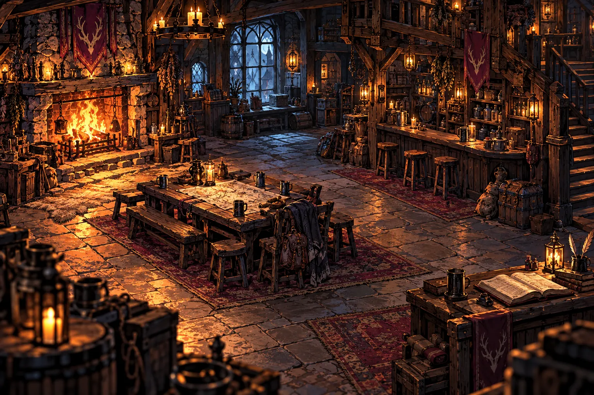

# Cellbound — illustrated world art bible

Status: Phase 1 proof for review. Inn only. September 2026.

## Identity

Dark illustrated fantasy online RPG. Places are the interface; adventurers inhabit them. Painted colour and material texture sit inside confident, broken ink contours. Adult, grounded proportions and practical equipment. Neither photorealism nor cartoon avatars. The supplied reference informs finish and lighting, not designs or composition.

The resting scene owns 70–80% of attention. Characters, a table and a ledger are the interaction points. Management can temporarily occupy most of the screen; closing it returns to the same room and preserves state.

[Open the interactive five-class proof](inn-art-review.html) to compare the room, characters and contextual tools together.

## Environment

- Establish architecture, walkable floor and clear character foot positions before adding props. Never place a standing character on a tabletop or in a wall.
- Use large readable masses: hearth, bar, table, stair and doorway. Detail enriches those masses rather than obscuring them.
- Ink silhouettes and material breaks; leave quieter interior paint. Stone has chipped planes, wood has directional grain, metal has small hard highlights, cloth has broad folds, leather has seams and rubbed edges.
- Use practical light sources. Copper firelight is the Inn's key light; cool petrol ambient light separates silhouettes. Other locations can change lighting, but retain the same material rendering and linework.
- Preserve shadow detail. Never obtain atmosphere by making essential objects unreadably black.
- Foreground props frame the lower corners; middle ground contains interaction; background contains quieter reserves and implied activity. No baked-in player characters or text.
- Author a separate mobile composition. Keep the main interaction anchors visible rather than cropping them away.

## Characters

Approximately seven-head adult proportions, adjusted to the established race anatomy. Faces use painted planes, readable eyes and selective ink. Avoid huge eyes, glossy skin, uniform body shapes or ornamental armour that conceals the class silhouette.

| Class | Silhouette | Material and accent | Prototype |
|---|---|---|---|
| Warrior | Broad, grounded plate | Rubbed steel, restrained oxblood | Braided woman, sword and round shield |
| Priest | Long layered vestments | Bone-grey cloth, muted ochre, pewter | Silver-haired man, staff and prayer book |
| Mage | Angular coat and vertical staff | Midnight teal cloth, small quartz light | Auburn-haired woman, staff and folio |
| Rogue | Lean asymmetry, close layers | Charcoal leather, muted plum | Ash-blond man, paired daggers |
| Hunter | Cloak and long bow profile | Moss-grey cloth, tawny leather | Curly-haired woman, bow and quiver |

These five paintings are **design prototypes**, not universal skins for all members of a class. They are only used in the isolated art-review page. A player's saved face or equipped weapon must never be replaced by whichever painting is available.

### Production modular contract

One appearance descriptor must feed world and tactical renderers: race/body profile, skin, face, hair, hair colour, facial hair, markings, eyes and racial features. One equipment descriptor supplies equipped slot, family, tier, weapon type, off-hand, set and special status. IDs, stats and gameplay remain untouched.

Painted layer order: rear cloak/quiver → legs/boots → torso → arms/hands → neck/head → hair/race features → front equipment → local highlights. Each family needs compatible neck, wrist, waist and grip anchors, shared canvas dimensions, transparent padding and a fixed foot pivot. A robe cannot be painted over unequipped legs to imply gear that is absent. Weapons/off-hands must follow the equipped item, including empty slots.

Tier changes should alter construction and silhouette: practical starter materials, reinforced mid-tier forms, distinctive set shapes, then restrained endgame motifs. Do not substitute a brighter aura for visible gear progression. Race proportions and facial customisation need painted coverage before replacing the current renderer.

Until those layers exist and pass identity tests, retain the existing data-driven representation in the live Inn. Do not call the full modular pipeline complete based on the five concept paintings.

## Interface

- Ink-black leather/wood surfaces; warm bone text; aged brass boundaries. Class colour is a small accent.
- Shared tokens: ink `#111619`, surface `#20201d`, raised `#2b2922`, brass `#a58755`, bright brass `#dbbc83`, text `#eee3cf`, secondary `#bcb29f`, cool shadow `#1b3039`.
- Georgia/serif for location and tool titles; existing system sans for controls, statistics and long text. No novelty font for body copy. Primary text 14–16px; secondary text at least 12px in new controls.
- Icons use simple inked silhouettes, consistent optical weight and matte material accents. Keep functional symbols recognisable at 20–24px. Pair unfamiliar actions with text; never mix emoji, glossy clip art and painted item thumbnails as equivalent controls. Keep rarity, class and danger colours semantically distinct.
- Strong outer framing belongs to contextual tools, not every row. Inside the Ledger use dividers and whitespace. Avoid nested card stacks.
- Buttons: solid readable idle surface; warmer hover; inset pressed state; clear 2px keyboard focus; disabled remains legible and visibly unavailable. Do not encode state only in colour.
- Keep 44px touch targets, visible close controls, Escape, focus return, readable native selects and safe-area spacing. Never remove working controls for composition.
- Backdrops dim rather than blur the entire world. Character panels preserve a visible portion of the room; mobile uses a bottom sheet.

## Content rules for later rollout

Boss art: decisive silhouette and encounter-specific materials; no unrelated illustration style. Quest scenes: same brush/ink balance and light logic, with quiet space for separate live text. Dungeon staging: show the actual threshold, party and route. Raid staging: separate ownership groups in physical dock space, driven by real readiness. PvP: two readable companies before the unchanged tactical combat. Crafting: practical workstation and only confirmed-success feedback.

## Delivery and performance

Use compressed WebP for these prototypes; preserve alpha on characters. No full-screen animated filters, videos or independent particle loops. Existing subtle hearth/idle animation uses transforms/opacity and stops under reduced motion. Artwork is static and should be decoded before visual review. Aim below 500KB per scene and 300KB per prototype cutout; review actual transfer sizes rather than assuming them.

## Review gate

Review the shared Inn scene at desktop, iPad landscape and mobile, with no overlay, character selected, Guild Ledger and Party Table. The isolated style review uses sample adventurers and never reads/writes a player save. Production roster interactions remain covered separately by the existing browser regression.

Approve environment, character rendering and UI together before proceeding to another location. Outstanding after this proof: production painted modular coverage, gear-family/tier variants, race coverage, physical iPad performance and art approval. No broader rollout is implied.
