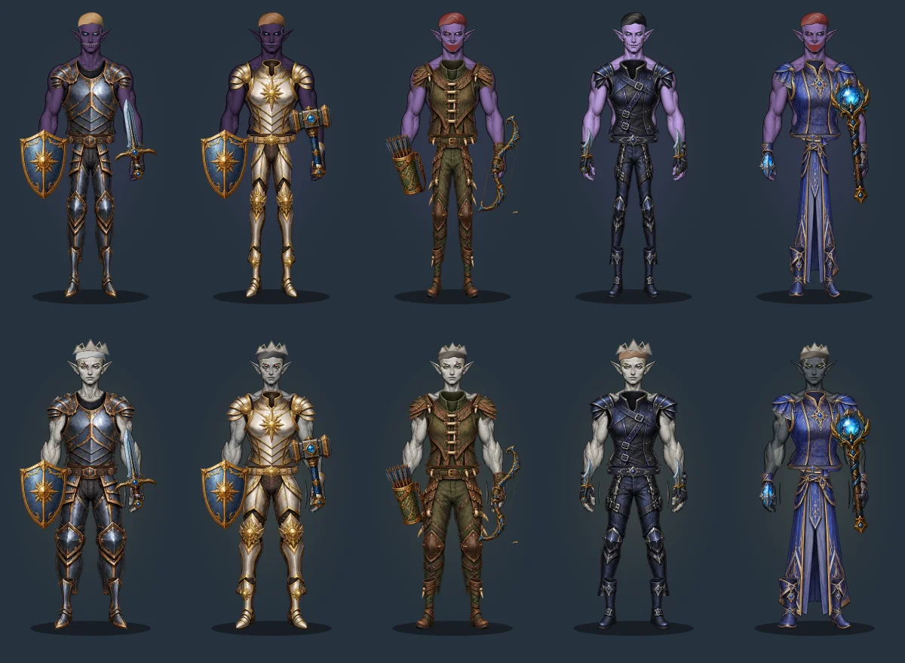
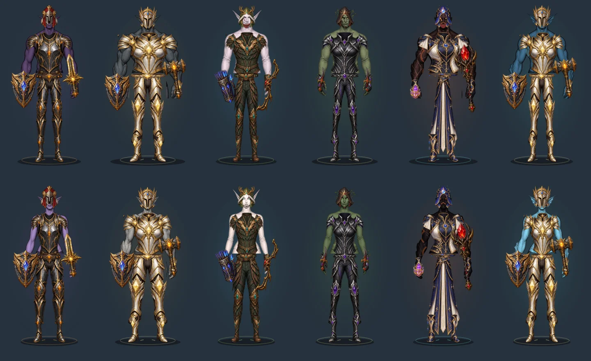

# Illustrated item rebuild — staging

Replaces the legacy equipment atlas, embedded material atlas, procedural item icons and procedural wearable geometry with 301 illustrated sprites. Item IDs, stats, drop rules, equipment records, inventory and progression are unchanged. No migration is required.

## Shared asset contract

`item-atlas-v2.js` registers ten compressed WebP sheets (5.55 MB total), trim rectangles and left/right registrations. `item-visuals-v2.js` resolves slot, class family, tier and weapon type for both icons and worn pieces. The browser caches each sheet across characters and slots; the existing bounded character markup cache remains in use. There are no per-character bitmap copies or continuously recomputed composites.

Five independently illustrated beta armour families have five authored tiers each, covering chest, shoulders, hands, waist, legs and feet. A further 25 helmets, 60 weapon/off-hand sprites, 30 accessory/consumable sprites and 36 crafting/loot sprites cover the wider catalogue through reusable families. These are family-based assets, not 925 individually commissioned item paintings. Non-beta classes use explicitly declared compatible families until dedicated art is added.

The same race/sex/build anatomical profile drives independent torso, shoulder, hand, leg and foot fitting. Equipment uses final painted-model coordinates instead of the old piecewise body warp. Chest coverage ends at the waist; legs own trousers and Mage robe skirts. Helmets suppress incompatible hair/growth; cloth hoods have a face-opening mask. Portraits consistently omit helmets. Main-hand and off-hand metadata determine sprite and grip placement.

## Production

Artwork was produced with the built-in image generation tool. Prompts and generation IDs are recorded in `tools/item-art-sources.json`; original generated PNGs remain in the session's generated-image directory. Compressed source sheets are committed under `assets/items/illustrated-v2/`.

`node tools/pack-item-art.cjs` registers the committed sheets; an optional JSON manifest can point at replacement source PNGs. `--encode` writes compressed sheets. This development utility requires Sharp. Registration uses alpha boundaries and connected component bounds to exclude neighbouring-cell fragments; runtime rendering does not run pixel analysis.

## Verification

- `npm run build`: existing gameplay, economy, combat, deployment and model contracts.
- `npm run test:appearance`: 36 base combinations, 2,700 slot-ownership cases, 9,360 catalogue renders and the bounded ten-character markup cache.
- `tests/illustrated-items.cjs`: all 301 sprite bounds, deployed atlas presence, 925 catalogue/material/recipe mappings, 60 full race/sex/class outfits, source agreement between icons and wearables, non-mutating render calls, distinct tier sources and crossbow/bow identity.
- Static visual review: beta class comparisons and all twelve race/sex bases with equipped T5 examples, shown below.
- Pull-request CI runs Chromium and WebKit full-game, creator/reload, combat and login regressions. Physical iPad/iPhone responsiveness and every possible mixed set still require hands-on staging review; automated renders are not a substitute for that acceptance step.

Deploy only to staging. Production promotion requires the user's later approval.
